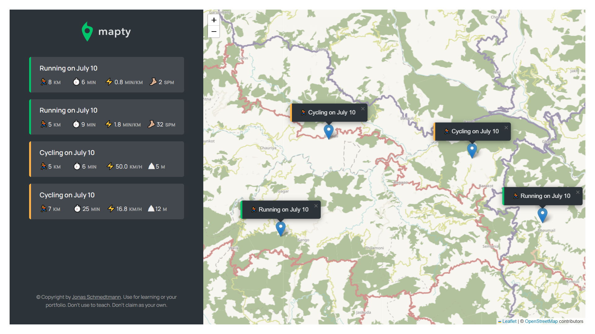
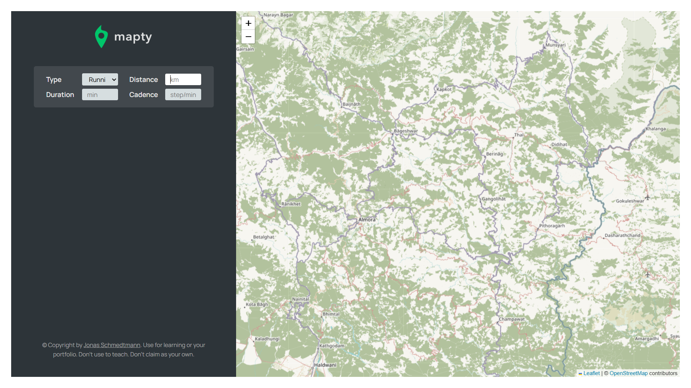

Original credits of the project go to Jonas Schmedtmann (The Complete JavaScript Course, Udemy)

# mapty-app-project

It is a beautiful app that uses leaflet library, where user can click on any position in the world map and mark its workout details, those details will be displayed on the map.

### To do list:

    - Delete workout
    - Edit workout
    - Change positions of workouts in the input section
